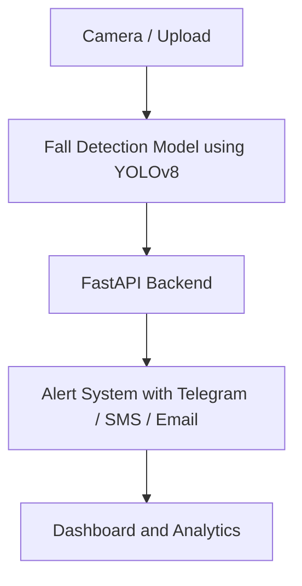

# EquiFall+  
### AI-Powered Fall Detection and Emergency Response System

Turning passive cameras into active caregivers.

---

## One-Line Pitch
EquiFall+ is an AI-powered system that detects falls in real time using video input and instantly alerts caregivers to ensure rapid response and improved elderly safety.

---

## Problem
Falls are one of the leading causes of injury among elderly individuals, especially those living alone.

- Delayed response can be life-threatening  
- Lack of real-time monitoring  
- Existing solutions rely on wearables, which are often ignored or forgotten  

---

## Solution
EquiFall+ uses computer vision to detect falls instantly from:
- CCTV cameras  
- Webcam feeds  
- Uploaded videos  

It then:
- Sends alerts automatically  
- Stores incidents  
- Provides analytics for prevention  

---

## Features

- Real-time fall detection  
- Pose-based AI analysis using YOLOv8  
- Emergency alerts via Telegram, SMS, and Email  
- Incident history and replay  
- Monitoring dashboard  
- Voice-based safety check (local environments only)  

---

## Tech Stack

### Frontend
- Lovable (React-based UI)

### Backend
- FastAPI (Python)

### AI / Computer Vision
- YOLOv8 Pose Model  
- OpenCV  

### Deployment
- Render (Backend)  
- Lovable (Frontend)

---

## How It Works

1. Capture video input (CCTV, Webcam, or Upload)  
2. Process frames using AI model  
3. Detect posture and sudden fall movement  
4. Trigger safety check  
5. If no response, notify emergency contacts  
6. Log incident and generate insights  

---

## Architecture
--

    

## Installation (Local Setup)

-- git clone https://github.com/arthika333/equifall.git
-- cd equifall
-- pip install -r requirements.txt python app.py
